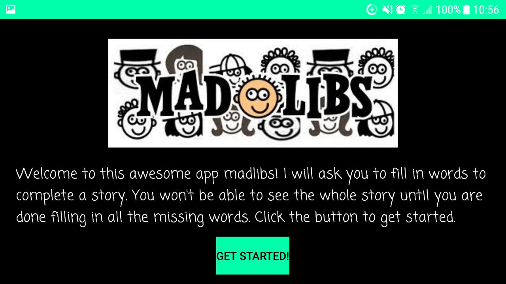
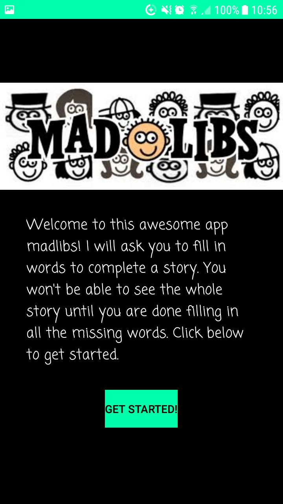
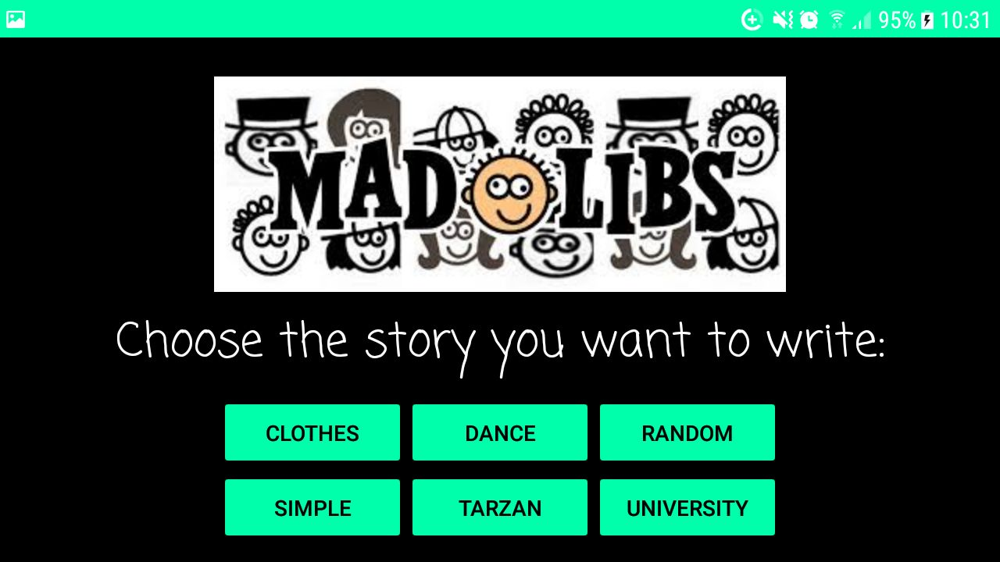
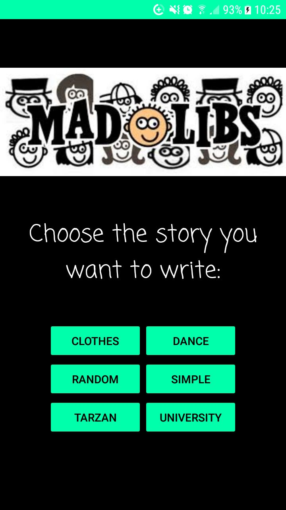
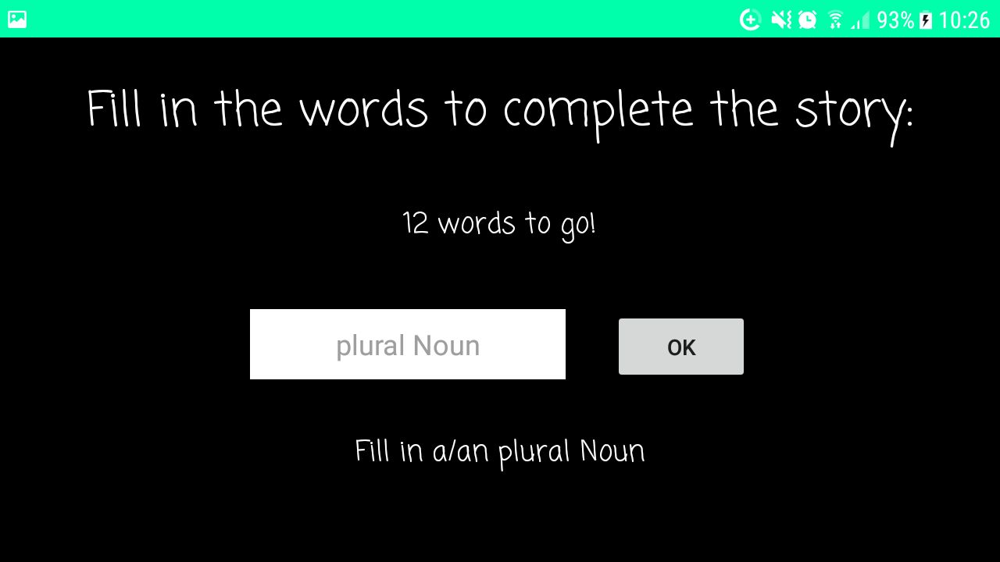
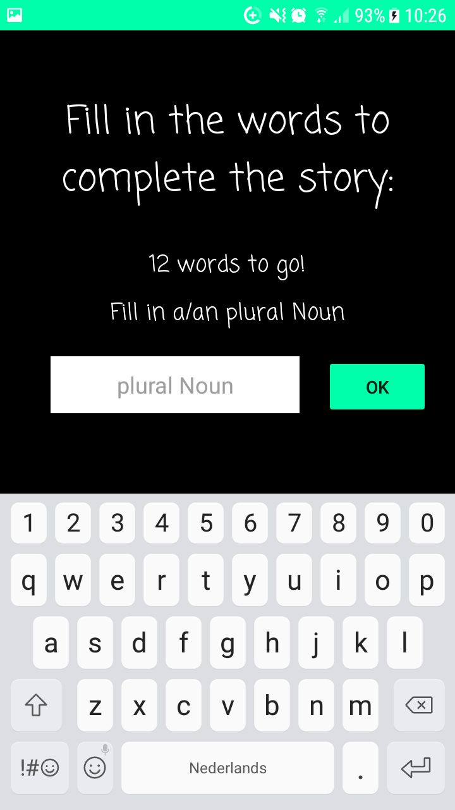
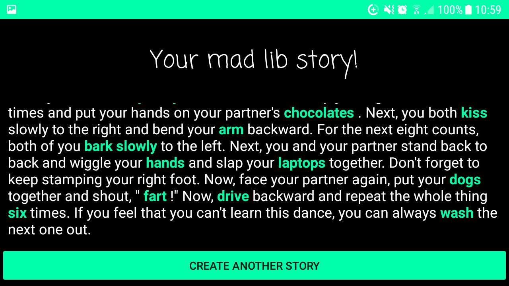
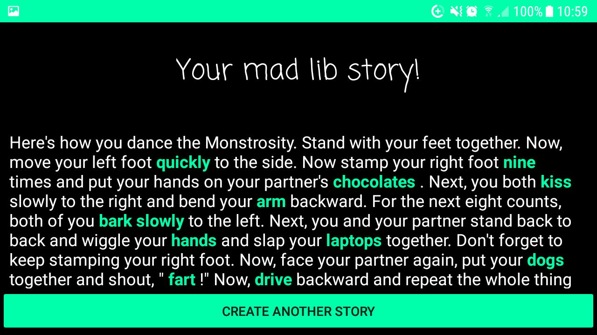
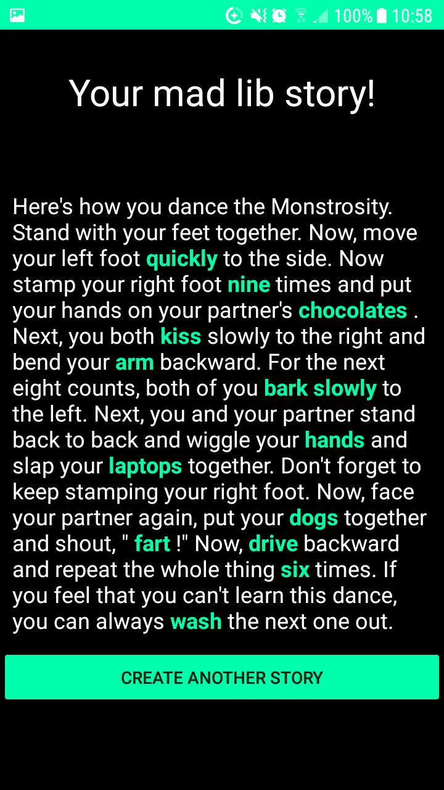

### BrittvanLeeuwen-pset1

“Mad Libs” are short stories that have blanks called placeholders to be filled in.
The user is asked to fill in each of the placeholders without knowing anything about the overall story (apart from the theme).
Once all placeholders are filled in, the resulting silly story is showed.

The app works in normal view and landscape view, as shown below in the screenshots.

